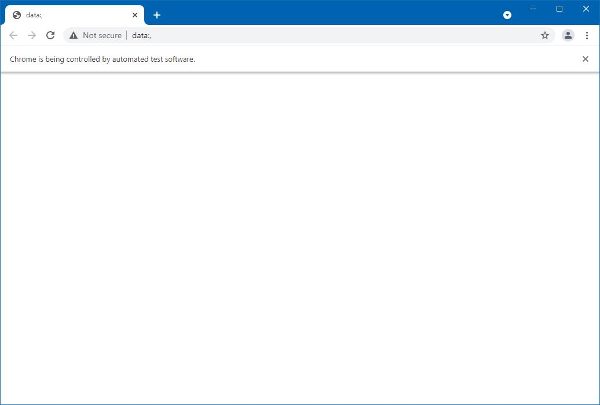

# NetBeans-Selenium

Hey there, I am going to walk you through on how to import **Selenium JAR** files and **Chrome Driver** into your NetBeans project.  You can either choose to follow the steps of go ahead and watch my video on how to do the same.

Before we get started, these are the websites from which we will be downloading the file.

- Selenium Driver - [Click Here](https://www.selenium.dev/downloads/)
- Chrome Driver - [Click Here](https://chromedriver.chromium.org/downloads)

### Video Links

- [NetBeans 12+](https://drive.google.com/file/d/1aVtG7bx1hdixeaOrdth6KFkAdgfXsOgj/view?usp=sharing)
- [NetBeans 8.2](https://drive.google.com/file/d/1_fCcCj34RybW4_d0UCBPpU2GU3E_zt1J/view?usp=sharing)

### Steps

1. Download the java version of selenium driver and unzip it wherever you would like to keep the files. 

2. Download the Chrome driver from the given link and choose the right version for your browser. 
   You can check your browser version by clicking on those three dots on the top right corner of your browser and choosing **Help > About** .

3. After downloading you can unzip it wherever you like to keep the file and also keep a copy of the file path for further use.

4. Open NetBeans and click on **File > New Project > Java > Java Application** and give it a name of your choice.

5. Once done, right click on the project and select properties and head over to libraries and click on Add JAR/Folders and head over to the location where you extracted Selenium driver in step 1 and select **client-combined-3.XXX.jar** file and also import all the other files under **libs** folder. 

6. Let's test the code  

   ```java
   System.setProperty("webdriver.chrome.driver",[PATH]);
   WebDriver driver = null;
   driver = new ChromeDriver();
   ```

   Here PATH refers to the chrome driver location which was extracted in step 3.

7. Run the code and you need to be able to see a blank chrome tab on your screen. 
   

**Date: 27/05/2021**